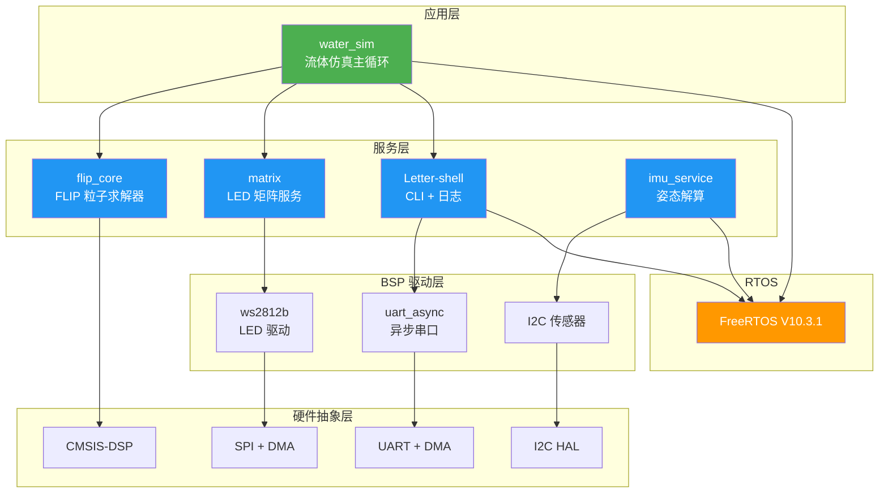

# Flip Matrix

> **在 16x16 LED 矩阵上运行实时流体仿真的嵌入式系统**

基于 STM32H750 (Cortex-M7) + FreeRTOS，使用 FLIP 粒子流体算法驱动 256 颗 WS2812B RGB LED，实现水波荡漾的视觉效果。支持 IMU 姿态感应和交互式 CLI 调参。

---

## 特性一览

- **FLIP 流体仿真** — 粒子+网格混合方法，CMSIS-DSP 硬件加速，实时计算密度场
- **WS2812B LED 矩阵** — 16x16 RGB 双缓冲 + SPI DMA 异步传输，零撕裂刷新
- **IMU 姿态估计** — Madgwick AHRS 算法，支持磁力计/无磁力计模式
- **Letter-shell CLI** — 交互式命令行接口，支持日志分级输出、Tab 补全
- **异步 UART 驱动** — DMA 收发 + FreeRTOS 流缓冲区，多任务安全
- **FreeRTOS V10.3.1** — 抢占式调度，独立 64KB 堆，运行时 CPU 统计

---

## 系统架构



### 模块职责

| 层级 | 模块 | 路径 | 职责 |
|------|------|------|------|
| 应用 | water_sim | `src/app/` | 仿真主循环、颜色映射、CLI 参数调节 |
| 服务 | flip_core | `src/service/flip/` | FLIP 粒子+网格求解器，CMSIS-DSP 加速 |
| 服务 | matrix | `src/service/matrix/` | 双缓冲、拓扑映射、异步 DMA 刷新 |
| 服务 | cli | `src/service/cli/` | Letter-shell 移植、日志系统、命令注册 |
| 服务 | imu | `src/service/imu/` | Madgwick AHRS 姿态解算 |
| 服务 | tools | `src/service/tools/` | 3D 向量数学、通用定义 |
| BSP | uart_async | `src/bsp/uart/` | DMA 异步 UART，FreeRTOS 流缓冲区 |
| BSP | ws2812b | `src/bsp/ws2812b/` | WS2812B SPI 编码 + DMA 异步发送 |

---

## 硬件需求

| 组件 | 型号 | 说明 |
|------|------|------|
| MCU | STM32H750VBTx | Cortex-M7, 480MHz, 128KB FLASH, 1MB SRAM |
| LED 矩阵 | WS2812B 16x16 | 256 RGB LED，SPI 接口驱动 |
| IMU（可选） | MPU6050 / ICM20948 | I2C 接口，用于姿态感应 |
| 调试器 | ST-Link V2 | SWD 调试烧录 |
| 串口工具 | CH340 / CP2102 | USB-TTL，连接 Letter-shell CLI |

### 接线参考

```
STM32H750          外设
─────────────────────────────
PA5  (SPI1_SCK)  → WS2812B DIN (通过 MOSI 编码)
PA7  (SPI1_MOSI) → WS2812B DIN
PB6  (I2C1_SCL)  → IMU SCL
PB7  (I2C1_SDA)  → IMU SDA
PA9  (USART1_TX) → USB-TTL RX
PA10 (USART1_RX) → USB-TTL TX
```

---

## 快速开始

### 环境准备

需要以下工具链：

- **arm-none-eabi-gcc** (>= 10.3) — ARM 交叉编译器
- **CMake** (>= 3.22) — 构建系统
- **Ninja** — 构建后端
- **ST-Link / OpenOCD** — 烧录调试

```powershell
# Windows (scoop)
scoop install gcc-arm-none-eabi cmake ninja openocd

# macOS (homebrew)
brew install --cask gcc-arm-embedded
brew install cmake ninja open-ocd

# Ubuntu/Debian
sudo apt install gcc-arm-none-eabi cmake ninja-build openocd
```

### 构建

```powershell
# 配置 (Debug 模式，-O0 -g3)
cmake --preset Debug

# 编译
cmake --build --preset Debug

# Release 模式 (-Os -g0)
cmake --preset Release
cmake --build --preset Release
```

输出文件：`build/Debug/H7RTOS.elf`

### 烧录

```powershell
# 使用 ST-Link
st-flash write build/Debug/H7RTOS.bin 0x08000000

# 使用 OpenOCD
openocd -f interface/stlink.cfg -f target/stm32h7x.cfg \
  -c "program build/Debug/H7RTOS.elf verify reset exit"
```

### 连接 CLI

使用串口终端连接 USART1（115200 8N1）：

```powershell
# minicom
minicom -D /dev/ttyUSB0 -b 115200

# puTTY / SecureCRT / MobaXterm
# 串口: COMx, 波特率: 115200, 数据位: 8, 停止位: 1, 校验: 无
```

连接后按回车即可看到 shell 提示符，输入 `help` 查看所有命令。

---

## CLI 命令参考

### 仿真控制

| 命令 | 参数 | 说明 |
|------|------|------|
| `wsim_gravity` | `<scale>` | 设置重力倍率（默认 9.81） |
| `wsim_solver` | `<push> <pressure> <flip>` | 调节求解器质量参数 |
| `wsim_color` | `<0\|1\|2>` | 颜色方案：0=蓝色渐变, 1=彩虹, 2=灰度 |
| `wsim_dt` | `<seconds>` | 设置仿真时间步长（默认 0.016s = 60Hz） |
| `wsim_status` | - | 打印当前仿真参数 |

### 矩阵控制

| 命令 | 参数 | 说明 |
|------|------|------|
| `mtrx_init` | `<rows> <cols> [topo]` | 初始化矩阵（topo: 0=逐行, 1=蛇形） |
| `mtrx_deinit` | - | 反初始化矩阵 |
| `mtrx_set` | `<row> <col> <r> <g> <b>` | 设置单个像素颜色 |
| `mtrx_fill` | `<r> <g> <b>` | 填充全部像素 |
| `mtrx_clear` | - | 清除全部像素 |
| `mtrx_show` | - | 将缓冲区刷新到 LED |
| `mtrx_info` | - | 显示矩阵信息 |

### 系统工具

| 命令 | 说明 |
|------|------|
| `cpu` | 显示各任务 CPU 占用率 |
| `help` | 显示所有可用命令 |
| `clear` | 清屏 |

### 使用示例

```
Shell>wsim_color 1          # 切换彩虹配色
Shell>wsim_gravity 15.0     # 增大重力
Shell>wsim_solver 6 20 0.8  # 提高求解精度
Shell>wsim_status           # 查看当前参数
Shell>mtrx_fill 255 0 0     # 全屏红色
Shell>mtrx_show             # 刷新显示
Shell>cpu                   # 查看 CPU 占用
```

---

<details>
<summary><b>内存布局</b></summary>

STM32H750VBTx 拥有多银行 SRAM 架构，本项目按用途分配各区域：

| 区域 | 地址 | 大小 | 用途 |
|------|------|------|------|
| ITCM | `0x00000000` | 64KB | 保留（未来热代码） |
| FLASH | `0x08000000` | 128KB | 代码、只读数据、向量表 |
| DTCM | `0x20000000` | 128KB | MSP 栈顶、newlib 堆 |
| AXI SRAM | `0x24000000` | 512KB | `.data`、`.bss`、FreeRTOS 堆 (64KB) |
| D2 SRAM | `0x30000000` | 288KB | `.dma_buffer`（WS2812B SPI 缓冲区） |
| D3 SRAM | `0x38000000` | 64KB | 未使用 |

**关键设计决策：**

- FreeRTOS 堆独立在 `.freertos_heap` section，不与通用 `.bss` 混合
- WS2812B 的 SPI DMA 缓冲区 (`spi_temp`) 放在 D2 SRAM 的 `.dma_buffer` section
- D2 SRAM 区域由 MPU 配置为 non-cacheable，避免 DCache 与 DMA 读写冲突
- DTCM 的 `0x20000000` 处设置为 MSP 栈顶

</details>

<details>
<summary><b>FLIP 流体算法</b></summary>

FLIP (Fluid-Implicit-Particle) 是一种混合拉格朗日-欧拉方法，结合了粒子法和网格法的优点：

```
1. 粒子 → 网格 (P2G)
   将粒子速度和权重插值到网格节点

2. 网格操作
   ├── 施加重力
   ├── 计算粒子密度
   ├── 压力求解 (Jacobi 迭代)
   └── 速度外推 (push apart)

3. 网格 → 粒子 (G2P)
   将网格速度插值回粒子，FLIP/PIC 混合

4. 粒子更新
   根据速度推进粒子位置
```

**FLIP vs PIC：**
- PIC (Particle-In-Cell)：网格平滑 → 数值粘性大，稳定
- FLIP：保留粒子历史 → 数值粘性小，可能不稳定
- 本项目使用混合比率 `flip_ratio`（默认 0.6）平衡两者

**CMSIS-DSP 加速：**
- `arm_offset_f32` — 重力加速度批量偏移
- `arm_scale_f32` — 速度时间步缩放
- `arm_add_f32` — 位置批量更新
- 64 元素分块处理，适配 Cortex-M7 缓存行

</details>

<details>
<summary><b>DMA 传输流程</b></summary>

### WS2812B SPI DMA 传输

```
用户任务写入 back_buffer
        │
        ▼
matrix_write_async() 被调用
        │
        ├── 等待上一帧 DMA 完成 (最长 20ms)
        │
        ├── 交换 front_buffer / back_buffer 指针
        │
        ├── ws2812b_write_async()
        │   ├── 将 GRB 颜色编码为 SPI 位序列
        │   │   (1 个 WS2812B bit = 16 个 SPI bit)
        │   │   逻辑 1 → 0xFFF8
        │   │   逻辑 0 → 0xE000
        │   ├── 前置 reset 低电平段
        │   └── 启动 HAL_SPI_Transmit_DMA()
        │
        └── 立即返回（不等待本帧完成）

DMA 完成中断 → 清除 busy 状态
```

### UART DMA 传输

- 发送：`uart_async_write()` → `HAL_UART_Transmit_DMA()` → 流缓冲区
- 接收：DMA 接收 + 空闲中断 → 流缓冲区 → shell 任务读取
- 多任务安全：FreeRTOS 流缓冲区 + 互斥锁保护

</details>

<details>
<summary><b>FreeRTOS 配置</b></summary>

| 配置项 | 值 | 说明 |
|--------|-----|------|
| `configTICK_RATE_HZ` | 1000 | 系统节拍 1ms |
| `configMAX_PRIORITIES` | 56 | 优先级数量 |
| `configTOTAL_HEAP_SIZE` | 65535 | 64KB 独立堆 |
| `configMAX_TASK_NAME_LEN` | 16 | 任务名最大长度 |
| `configUSE_PREEMPTION` | 1 | 抢占式调度 |
| `configUSE_MUTEXES` | 1 | 互斥锁 |
| `configUSE_RECURSIVE_MUTEXES` | 1 | 递归互斥锁 |
| `configUSE_COUNTING_SEMAPHORES` | 1 | 计数信号量 |
| `configGENERATE_RUN_TIME_STATS` | 1 | 运行时 CPU 统计 |
| `configCHECK_FOR_STACK_OVERFLOW` | 2 | 栈溢出检测 |

### 任务分配

| 任务 | 优先级 | 栈大小 | 职责 |
|------|--------|--------|------|
| defaultTask | Low | 2048B | 系统初始化、LED 心跳 |
| water_sim | 10 | 4096B | FLIP 仿真计算 + LED 刷新 |
| shell | - | - | CLI 命令解析和执行 |

</details>

---

## 项目结构

```
H7RTOS/
├── Core/                        # CubeMX 生成的 HAL 代码
│   ├── Inc/                     #   头文件
│   │   ├── FreeRTOSConfig.h     #     FreeRTOS 配置
│   │   └── main.h
│   └── Src/                     #   源文件
│       ├── main.c               #     入口、时钟配置、MPU
│       ├── freertos.c           #     任务创建、启动流程
│       ├── usart.c              #     USART1 初始化
│       ├── spi.c                #     SPI1 初始化
│       └── dma.c                #     DMA 通道配置
│
├── src/                         # 项目应用代码
│   ├── app/                     #   应用层
│   │   ├── app_water_sim.c      #     流体仿真主循环
│   │   ├── app_water_sim.h
│   │   └── app_water_sim_cmd.c  #     CLI 命令注册
│   │
│   ├── service/                 #   服务层
│   │   ├── flip/                #     FLIP 流体仿真
│   │   │   ├── flip_core.c      #       粒子+网格求解器
│   │   │   └── flip_core.h
│   │   ├── matrix/              #     LED 矩阵服务
│   │   │   ├── matrix.c         #       双缓冲、拓扑映射
│   │   │   ├── matrix.h
│   │   │   ├── matrix_cmd.c     #       CLI 命令
│   │   │   └── README.md        #       模块文档
│   │   ├── cli/                 #     CLI 服务
│   │   │   ├── shell.c/h        #       Letter-shell 核心
│   │   │   ├── shell_ext.c/h    #       参数解析扩展
│   │   │   ├── shell_cfg.h      #       Shell 配置
│   │   │   ├── shell_cmd_list.c #       内置命令表
│   │   │   ├── shell_companion.c#       伴生对象
│   │   │   ├── cpu_cmd.c        #       CPU 统计命令
│   │   │   ├── port/            #       移植层
│   │   │   │   ├── shell_port.c #         UART 适配
│   │   │   │   └── shell_port.h
│   │   │   └── log/             #       日志系统
│   │   │       ├── log.c
│   │   │       └── log.h
│   │   ├── imu/                 #     IMU 服务
│   │   │   ├── imu_service.c/h  #       姿态解算服务
│   │   │   └── MadgwickAHRS/    #       Madgwick 算法
│   │   └── tools/               #     公共工具
│   │       ├── vec_math.c/h     #       3D 向量/旋转数学
│   │       └── common_def.c/h   #       通用定义、错误码
│   │
│   └── bsp/                     #   BSP 驱动层
│       ├── uart/                #     异步 UART
│       │   └── uart_async.c/h   #       DMA 收发 + 流缓冲区
│       └── ws2812b/             #     WS2812B LED 驱动
│           ├── driver_ws2812b.c/h         # 驱动核心
│           └── driver_ws2812b_interface.c/h # SPI DMA 适配
│
├── Drivers/                     # ST HAL + CMSIS
├── Middlewares/                 # FreeRTOS V10.3.1
├── CMakeLists.txt               # 构建配置
├── CMakePresets.json            # 构建预设 (Debug/Release)
└── STM32H750XX_FLASH.ld         # 链接脚本
```

---

## 依赖

| 库 | 版本 | 用途 |
|----|------|------|
| STM32 HAL | CubeMX 生成 | 硬件抽象层 |
| FreeRTOS | V10.3.1 | 实时操作系统 |
| CMSIS-DSP | - | Cortex-M7 FPU 数学加速 |
| CMSIS-NN | - | 神经网络加速（预留） |
| Letter-shell | V3.2.4 | 交互式 CLI |
| WS2812B Driver | - | LED 驱动（SPI 编码） |
| MadgwickAHRS | - | 姿态估计算法 |

---

## 致谢

- **FLIP 算法** — 基于 [Matthias Müller - Ten Minute Physics](https://www.youtube.com/c/TenMinutePhysics) 的实现移植到嵌入式平台
- **Letter-shell** — [NevermindZZT](https://github.com/NevermindZZT/letter-shell) 的嵌入式 shell 框架
- **WS2812B Driver** — 基于 [LibDriver](https://github.com/libdriver/ws2812b) 的 SPI 驱动适配

---

## License

MIT License
